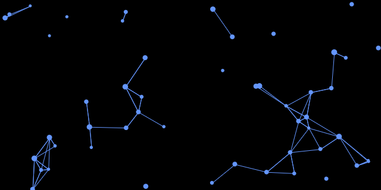

# 365 Mini projects

## 3 - Project title: Sparkling Sky Not Interactive



Today was hell, so here is a simplification of a past thingy I did.

Day 4 - 4/12/20 - Started... Finished...
hours spent -> 1

```javascript
new p5();

var nr = 50;
var nrShow = 50;

X = new float(nr);
Y = new float(nr);

Xx = new float(nr);
Yy = new float(nr);

velX = new float(nr);
velY = new float(nr);

size = new float(nr);

function setup() {
  createCanvas(640, 320);

  for (i = 0; i < nr; i++) {
    X[i] = random(width);
    Y[i] = random(height);
    velX[i] = random(-0.3, 0.3);
    velY[i] = random(-0.3, 0.3);
    size[i] = random(5, 10);
  }
}

function draw() {
  background(0);

  for (i = 0; i < nrShow; i++) {
    X[i] = X[i] + velX[i];
    Y[i] = Y[i] + velY[i];

    if (X[i] > width) {
      X[i] = 1;
    }
    if (X[i] < 0) {
      X[i] = width;
    }
    if (Y[i] > height) {
      Y[i] = 1;
    }
    if (Y[i] < 0) {
      Y[i] = height;
    }

    fill(100, 150, 255);
    noStroke();
    ellipse(X[i], Y[i], size[i], size[i]);

    angle = atan2(X[i], Y[i]);
    newX = cos(angle) * velX[i] + X[i];
    newY = sin(angle) * velY[i] + Y[i];
    X[i] = newX;
    Y[i] = newY;
  }

  for (i1 = 0; i1 < nrShow; i1++) {
    for (i2 = 0; i2 < nrShow; i2++) {
      distance1 = dist(X[i1], Y[i1], X[i2], Y[i2]);
      if (distance1 < size[i1] * 7) {
        push();
        stroke(100, 150, 255);
        line(X[i1], Y[i1], X[i2], Y[i2]);
        pop();
      }
    }
  }
}
```
